# PRIMOSA System Diagrams

## Overview

This document provides visual representations of PRIMOSA's system architecture, workflows, and interactions through various UML diagrams. These diagrams help understand how different actors interact with the system and how processes flow through the application.

## System Actors

PRIMOSA is designed for three main actors, each with distinct roles and permissions:

1. **Student** – Can view resources, download forms, access personal information, and view events
2. **Faculty/Staff** – Has all student permissions plus the ability to upload resources, manage forms, and view analytics
3. **OSA Staff/Administrator** – Has full system access including user management, system configuration, and comprehensive analytics

---

## Use Case Diagram

The use case diagram illustrates how different actors interact with PRIMOSA's modules based on their assigned roles.


### Use Case Descriptions

**Student Use Cases:**
- **View Resources** – Browse and access available forms and documents
- **Download Forms** – Download SOA, GTC, and POD templates and uploaded files
- **Preview Documents** – Preview documents before downloading
- **View Events** – Access event calendar and details
- **Manage Profile** – Update personal information and profile picture

**Faculty/Staff Use Cases:**
- All Student use cases, plus:
- **Upload Resources** – Upload new forms and documents to the system
- **Manage Forms** – Edit, delete, and organize form templates
- **View Analytics** – Access resource usage statistics and reports
- **Export Reports** – Download analytics data in CSV format
- **Create Tasks** – Create and assign tasks to team members
- **Manage Events** – Create, edit, and delete events

**OSA Staff/Administrator Use Cases:**
- All Faculty/Staff use cases, plus:
- **Manage Users** – Create, edit, delete, and assign roles to users
- **Configure System** – Modify system settings and configurations
- **Generate Reports** – Create automated reports from system data
- **Track Activity** – Monitor all user activities and system logs

---

## Activity Diagrams

Activity diagrams show the flow of activities across User, Client (Browser), and Server components, illustrating how different parts of the system interact during key operations.

### 1. Activity Diagram: Document Upload Process

This diagram illustrates the workflow when a Faculty/Staff member uploads a document to PRIMOSA.

```mermaid
%%{init: {'theme':'base'}}%%
flowchart TD
    subgraph User["👤 User (Faculty/Staff)"]
        U1([Start])
        U2[Navigate to Resource Page]
        U3[Select Form Type:<br/>SOA/GTC/POD]
        U4[Click Upload Button]
        U5[Select File from Device]
        U6[Click Submit]
        U7[View Success Message]
        U8([End])
    end
    
    subgraph Client["💻 Client (Browser)"]
        C1{Check<br/>Authentication}
        C2[Display Resource Page]
        C3[Show Upload Form]
        C4[Display File Selector]
        C5[Validate File Type<br/>and Size]
        C6{File<br/>Valid?}
        C7[Show Error Message]
        C8[Send Upload Request<br/>with File Data]
        C9[Display Success<br/>and Refresh List]
    end
    
    subgraph Server["🖥️ Server (Laravel)"]
        S1{User has<br/>canEdit<br/>Permission?}
        S2[Return 403 Error]
        S3[Validate Request:<br/>- MIME type doc/docx<br/>- Size ≤ 10MB]
        S4{Validation<br/>Passed?}
        S5[Return Validation<br/>Errors]
        S6[Generate Unique<br/>Filename with Timestamp]
        S7[Store File to<br/>Storage Disk]
        S8[Log to<br/>resource_access_logs<br/>table]
        S9[Return Success<br/>Response]
    end
    
    U1 --> U2
    U2 --> C1
    C1 -->|Not Logged In| C7
    C1 -->|Logged In| S1
    S1 -->|No Permission| S2
    S2 --> C7
    S1 -->|Has Permission| C2
    C2 --> U3
    U3 --> U4
    U4 --> C3
    C3 --> U5
    U5 --> C4
    C4 --> U6
    U6 --> C5
    C5 --> C6
    C6 -->|No| C7
    C7 --> U4
    C6 -->|Yes| C8
    C8 --> S3
    S3 --> S4
    S4 -->|No| S5
    S5 --> C7
    S4 -->|Yes| S6
    S6 --> S7
    S7 --> S8
    S8 --> S9
    S9 --> C9
    C9 --> U7
    U7 --> U8
    
    style User fill:#e1f5ff
    style Client fill:#fff4e1
    style Server fill:#ffe1e1
```



### 2. Activity Diagram: User Login Process

This diagram shows the authentication workflow when a user logs into PRIMOSA.


### 3. Activity Diagram: Event Creation Process

This diagram illustrates the workflow when a Faculty/Staff member creates a new event.

```mermaid
%%{init: {'theme':'base'}}%%
flowchart TD
    subgraph User["👤 User (Faculty/Staff)"]
        U1([Start])
        U2[Navigate to Events Page]
        U3[Click Create Event Button]
        U4[Fill Event Form:<br/>- Title<br/>- Description<br/>- Start Date<br/>- End Date<br/>- Venue<br/>- Type]
        U5[Click Submit]
        U6[View Error Messages]
        U7[View Success Message<br/>and Event Details]
        U8([End])
    end
    
    subgraph Client["💻 Client (Browser)"]
        C1[Display Events Page]
        C2[Show Event Creation Form]
        C3[Validate Form Fields]
        C4{All Fields<br/>Valid?}
        C5[Show Client-Side<br/>Validation Errors]
        C6[Send Create Event<br/>Request]
        C7[Display Validation<br/>Errors from Server]
        C8[Display Success<br/>and Redirect to Event]
    end
    
    subgraph Server["🖥️ Server (Laravel)"]
        S1[Receive Event<br/>Creation Request]
        S2[Validate Request Data:<br/>- Title min 3 chars<br/>- Description required<br/>- End date > Start date<br/>- Venue required<br/>- Type in allowed list]
        S3{Validation<br/>Passed?}
        S4[Return Validation<br/>Errors]
        S5[Prepare Event Data]
        S6[Set Default Values:<br/>- status = upcoming<br/>- created_by = user_id]
        S7[Begin Database<br/>Transaction]
        S8[INSERT INTO<br/>events table]
        S9{Insert<br/>Success?}
        S10[Rollback Transaction]
        S11[Return Database Error]
        S12[Commit Transaction]
        S13[Return Success with<br/>Event Object]
    end
    
    U1 --> U2
    U2 --> C1
    C1 --> U3
    U3 --> C2
    C2 --> U4
    U4 --> U5
    U5 --> C3
    C3 --> C4
    C4 -->|No| C5
    C5 --> U6
    U6 --> U4
    C4 -->|Yes| C6
    C6 --> S1
    S1 --> S2
    S2 --> S3
    S3 -->|No| S4
    S4 --> C7
    C7 --> U6
    S3 -->|Yes| S5
    S5 --> S6
    S6 --> S7
    S7 --> S8
    S8 --> S9
    S9 -->|No| S10
    S10 --> S11
    S11 --> C7
    S9 -->|Yes| S12
    S12 --> S13
    S13 --> C8
    C8 --> U7
    U7 --> U8
    
    style User fill:#e1f5ff
    style Client fill:#fff4e1
    style Server fill:#ffe1e1
```



### 4. Activity Diagram: Viewing and Exporting Analytics

This diagram shows the workflow when a Faculty/Staff or Administrator views and exports analytics data.


### 4. Activity Diagram: User Management Process

This diagram shows the system's internal workflow for managing users and role assignments.


### 5. Activity Diagram: Resource View and Download

This diagram illustrates the system's process for viewing and downloading resources with analytics tracking.

```mermaid
flowchart TD
    Start([Resource Request Received]) --> ParseRequest[Parse Request Parameters]
    ParseRequest --> DetermineAction{Request<br/>Type?}
    
    DetermineAction -->|View Page| ProcessView[Process View Request]
    DetermineAction -->|Download Template| ProcessTemplateDownload[Process Template Download]
    DetermineAction -->|Download File| ProcessFileDownload[Process File Download]
    DetermineAction -->|Preview| ProcessPreview[Process Preview Request]
    
    ProcessView --> CheckAuth{User<br/>Authenticated?}
    CheckAuth -->|No| RedirectLogin[Redirect to Login]
    RedirectLogin --> End([End])
    
    CheckAuth -->|Yes| DetermineFormType{Form<br/>Type?}
    DetermineFormType -->|SOA| SetSOAType[Set form_type = soa]
    DetermineFormType -->|GTC| SetGTCType[Set form_type = gtc]
    DetermineFormType -->|POD| SetPODType[Set form_type = pod]
    
    SetSOAType --> LogView[Log View Access]
    SetGTCType --> LogView
    SetPODType --> LogView
    
    LogView --> InsertViewLog[INSERT INTO resource_access_logs:<br/>action=view, form_type,<br/>user_id, IP, user_agent]
    InsertViewLog --> RenderView[Render Resource View]
    RenderView --> ReturnHTML[Return HTML Response]
    ReturnHTML --> End
    
    ProcessTemplateDownload --> ExtractTemplate[Extract Template Name<br/>from Query String]
    ExtractTemplate --> BuildPath[Build Template Path:<br/>public/forms/{type}/{name}.docx]
    BuildPath --> CheckFileExists{File<br/>Exists?}
    
    CheckFileExists -->|No| ReturnError[Return Error:<br/>Template Not Found]
    ReturnError --> End
    
    CheckFileExists -->|Yes| LogDownload[Log Download Access]
    LogDownload --> InsertDownloadLog[INSERT INTO resource_access_logs:<br/>action=download,<br/>form_name, file_path]
    InsertDownloadLog --> ReadFile[Read File from Disk]
    ReadFile --> SetDownloadHeaders[Set Response Headers:<br/>Content-Type: application/vnd...<br/>Content-Disposition: attachment]
    SetDownloadHeaders --> StreamFile[Stream File to Browser]
    StreamFile --> End
    
    ProcessFileDownload --> ExtractFilename[Extract Filename<br/>from Query String]
    ExtractFilename --> BuildStoragePath[Build Storage Path:<br/>storage/app/public/forms/{type}/uploads/{file}]
    BuildStoragePath --> CheckStorageExists{File<br/>Exists?}
    
    CheckStorageExists -->|No| ReturnNotFound[Return Error:<br/>File Not Found]
    ReturnNotFound --> End
    
    CheckStorageExists -->|Yes| LogFileDownload[Log File Download]
    LogFileDownload --> InsertFileLog[INSERT INTO resource_access_logs:<br/>action=download]
    InsertFileLog --> GetFilePath[Get Full File Path]
    GetFilePath --> SetFileHeaders[Set Download Headers]
    SetFileHeaders --> StreamUploadedFile[Stream File to Browser]
    StreamUploadedFile --> End
    
    ProcessPreview --> ExtractPreviewFile[Extract File/Template Name]
    ExtractPreviewFile --> DeterminePreviewType{Preview<br/>Type?}
    
    DeterminePreviewType -->|Template| BuildTemplatePath[Build Template Path]
    DeterminePreviewType -->|Uploaded File| BuildUploadPath[Build Upload Path]
    
    BuildTemplatePath --> CheckPreviewExists{File<br/>Exists?}
    BuildUploadPath --> CheckPreviewExists
    
    CheckPreviewExists -->|No| ReturnPreviewError[Return Preview Error]
    ReturnPreviewError --> End
    
    CheckPreviewExists -->|Yes| LogPreview[Log Preview Access]
    LogPreview --> InsertPreviewLog[INSERT INTO resource_access_logs:<br/>action=preview]
    InsertPreviewLog --> RenderPreviewView[Render Preview View<br/>with File Info]
    RenderPreviewView --> ReturnPreviewHTML[Return Preview HTML]
    ReturnPreviewHTML --> End
```

### 6. Activity Diagram: Event Management Workflow

This diagram shows the complete system workflow for event creation, updates, and deletion.

```mermaid
flowchart TD
    Start([Event Request Received]) --> CheckAuth[Verify User Authentication]
    CheckAuth --> CheckPerms{User has<br/>canEdit?}
    
    CheckPerms -->|No| Abort403[Abort 403 Unauthorized]
    Abort403 --> End([End])
    
    CheckPerms -->|Yes| DetermineOperation{Operation<br/>Type?}
    
    DetermineOperation -->|Create| ValidateCreate[Validate Create Request]
    DetermineOperation -->|Update| ValidateUpdate[Validate Update Request]
    DetermineOperation -->|Delete| ValidateDelete[Validate Delete Request]
    DetermineOperation -->|View| ProcessView[Process View Request]
    
    ValidateCreate --> CheckTitle{Title Valid?<br/>min: 3 chars}
    CheckTitle -->|No| CollectErrors[Collect Validation Errors]
    CollectErrors --> ReturnErrors[Return 422 with Errors]
    ReturnErrors --> End
    
    CheckTitle -->|Yes| CheckDescription{Description<br/>Present?}
    CheckDescription -->|No| CollectErrors
    
    CheckDescription -->|Yes| CheckStartDate{Start Date<br/>Valid?}
    CheckStartDate -->|No| CollectErrors
    
    CheckStartDate -->|Yes| CheckEndDate{End Date Valid?<br/>after start_date}
    CheckEndDate -->|No| CollectErrors
    
    CheckEndDate -->|Yes| CheckVenue{Venue<br/>Present?}
    CheckVenue -->|No| CollectErrors
    
    CheckVenue -->|Yes| CheckEventType{Type Valid?<br/>social/academic/etc}
    CheckEventType -->|No| CollectErrors
    
    CheckEventType -->|Yes| PrepareEventData[Prepare Event Data]
    PrepareEventData --> SetCreatedBy[Set created_by = auth()->id()]
    SetCreatedBy --> SetStatus[Set status = upcoming]
    SetStatus --> BeginTransaction[Begin Database Transaction]
    
    BeginTransaction --> InsertEvent[INSERT INTO events table]
    InsertEvent --> CheckInsert{Insert<br/>Success?}
    
    CheckInsert -->|No| Rollback[Rollback Transaction]
    Rollback --> ReturnDBError[Return Database Error]
    ReturnDBError --> End
    
    CheckInsert -->|Yes| CommitCreate[Commit Transaction]
    CommitCreate --> GetEventId[Get Generated event_id]
    GetEventId --> RedirectShow[Redirect to Event Show Page]
    RedirectShow --> End
    
    ValidateUpdate --> CheckEventExists{Event<br/>Exists?}
    CheckEventExists -->|No| Return404[Return 404 Not Found]
    Return404 --> End
    
    CheckEventExists -->|Yes| ValidateUpdateFields[Validate Update Fields]
    ValidateUpdateFields --> CheckUpdateValid{All Fields<br/>Valid?}
    
    CheckUpdateValid -->|No| CollectErrors
    CheckUpdateValid -->|Yes| CheckStatusValid{Status Valid?<br/>upcoming/ongoing/<br/>completed/cancelled}
    
    CheckStatusValid -->|No| CollectErrors
    CheckStatusValid -->|Yes| BeginUpdateTrans[Begin Transaction]
    
    BeginUpdateTrans --> UpdateEvent[UPDATE events table<br/>SET fields WHERE id = ?]
    UpdateEvent --> CheckUpdate{Update<br/>Success?}
    
    CheckUpdate -->|No| Rollback
    CheckUpdate -->|Yes| CommitUpdate[Commit Transaction]
    CommitUpdate --> RedirectUpdated[Redirect to Event Show]
    RedirectUpdated --> End
    
    ValidateDelete --> CheckDeleteEvent{Event<br/>Exists?}
    CheckDeleteEvent -->|No| Return404
    
    CheckDeleteEvent -->|Yes| BeginDeleteTrans[Begin Transaction]
    BeginDeleteTrans --> SoftDelete[Soft DELETE:<br/>UPDATE events<br/>SET deleted_at = NOW()]
    SoftDelete --> CheckDeleteSuccess{Delete<br/>Success?}
    
    CheckDeleteSuccess -->|No| Rollback
    CheckDeleteSuccess -->|Yes| CommitDelete[Commit Transaction]
    CommitDelete --> RedirectIndex[Redirect to Events Index]
    RedirectIndex --> End
    
    ProcessView --> QueryEvent[SELECT * FROM events<br/>WHERE id = ?]
    QueryEvent --> CheckEventFound{Event<br/>Found?}
    
    CheckEventFound -->|No| Return404
    CheckEventFound -->|Yes| LoadRelations[Load Related Data:<br/>creator, participants]
    LoadRelations --> RenderEventView[Render Event View]
    RenderEventView --> ReturnHTML[Return HTML Response]
    ReturnHTML --> End
```

---

## Sequence Diagrams

Sequence diagrams show the interactions between different system components over time.

### Sequence Diagram 1: User Login Process

This diagram shows the authentication flow when a user logs into PRIMOSA.


### Sequence Diagram 2: Uploading a Document

This diagram illustrates the document upload process in the Resource Management system.


### Sequence Diagram 3: Generating a Report

This diagram shows the analytics report generation and export process.


---

## Deployment Diagram

PRIMOSA is deployed using a cloud-based hosting environment accessible to students, faculty, and OSA personnel through a web browser.


### Deployment Architecture Details

**Client Layer:**
- **Student Browser** – Access via any modern web browser (Chrome, Firefox, Safari, Edge)
- **Faculty Browser** – Same browser requirements with additional upload capabilities
- **Admin Browser** – Full administrative access through web interface

**Network Layer:**
- **HTTPS/SSL** – All traffic encrypted using TLS 1.2 or higher
- **Port 443** – Secure HTTPS communication
- **Firewall** – cPanel firewall protecting server resources

**Web Server Layer:**
- **Apache/Nginx** – Handles HTTP requests and serves static assets
- **PHP 8.2+** – Executes Laravel application code
- **Vite Assets** – Compiled JavaScript and CSS files

**Application Layer:**
- **Laravel 12** – Main application framework handling all business logic
- **Livewire Components** – Real-time reactive components
- **Queue Worker** – Background job processing (emails, reports, file processing)
- **Scheduler** – Automated tasks and maintenance jobs

**Storage Layer:**
- **File Storage** – Stores uploaded documents, form templates, profile pictures
- **Application Logs** – Error logs, access logs, activity logs
- **Session Storage** – User session data

**Database Layer:**
- **MySQL 8.0+** – Relational database storing all application data
- **Tables** – users, resource_access_logs, tasks, events, documents, etc.
- **Indexes** – Optimized for query performance

**External Services:**
- **Email Server (SMTP)** – Sends notifications, password resets, alerts
- **Backup Service** – Automated daily backups of database and files
- **phpMyAdmin** – Database administration interface

### Deployment Specifications

**Server Requirements:**
- PHP 8.2 or higher
- MySQL 8.0 or higher
- Composer 2.x
- Node.js 18+ and NPM
- Minimum 2GB RAM
- Minimum 20GB storage
- SSL certificate installed

**Security Measures:**
- HTTPS enforced for all connections
- CSRF protection on all forms
- SQL injection prevention via Eloquent ORM
- XSS protection with output escaping
- Rate limiting on authentication endpoints
- File upload validation and sanitization
- Role-based access control (RBAC)

**Scalability:**
- Horizontal scaling via load balancer (future)
- Database replication for read operations (future)
- CDN for static assets (future)
- Redis caching for session and data (future)

---

## System Integration Points

### Authentication Flow
1. User submits credentials
2. Laravel validates against database
3. Jetstream creates secure session
4. User redirected to role-appropriate dashboard

### File Upload Flow
1. User selects file and submits form
2. Laravel validates file type and size
3. File stored in secure directory
4. Metadata saved to database
5. Activity logged for analytics

### Analytics Flow
1. User actions trigger logging
2. FormAccessLog model records activity
3. Data aggregated for dashboard display
4. Reports generated on-demand
5. CSV export available for external analysis

### Report Generation Flow
1. Admin requests report with filters
2. System queries database with criteria
3. Data processed and formatted
4. CSV file generated with timestamp
5. Download triggered to user browser

---

## Conclusion

These diagrams provide a comprehensive visual representation of PRIMOSA's architecture, workflows, and deployment structure. They serve as essential documentation for developers, administrators, and stakeholders to understand how the system operates and how different components interact with each other.

For technical implementation details, refer to the [TOOLS-AND-TECHNOLOGIES.md](TOOLS-AND-TECHNOLOGIES.md) document.


---

## Deployment Architecture Explanation

### Figure: PRIMOSA Deployment Diagram

The deployment diagram represents the hardware and software infrastructure required to host and access the PRIMOSA system. The architecture follows a client-server model with the following components:

**Host Machine (Server Side)**

The host machine serves as the central server infrastructure that runs the PRIMOSA application. It consists of two primary components working in tandem:

1. **PRIMOSA System served through PHP** - The Laravel 11 application running on PHP 8.2+ serves as the core system, handling all business logic, user authentication, data processing, and request routing. The application is served through a web server (Apache or Nginx) that processes HTTP/HTTPS requests from client devices. The PHP runtime executes the Laravel framework code, processes Livewire components for dynamic interfaces, and generates HTML responses that are sent back to client browsers.

2. **Database Management System (MySQL)** - MySQL 8.0+ serves as the relational database management system, storing all persistent data including user accounts with authentication credentials, student profiles with academic and personal information, event records with scheduling details, resource metadata and file paths, form submissions with approval statuses, and analytics logs tracking all system activities. The database communicates directly with the PHP application through secure database connections using Eloquent ORM for data operations.

**Communication Protocol**

The host machine and client devices communicate through HTTP/HTTPS protocols over the internet or local network. HTTPS is strongly recommended for production environments to ensure encrypted data transmission, protecting sensitive student information, user credentials, and institutional data during transit. The bidirectional arrows in the diagram indicate request-response cycles where clients send HTTP requests to the server (such as page loads, form submissions, or file downloads) and receive responses containing the requested data, rendered HTML pages, or confirmation of actions performed.

**Client Device (User Side)**

Client devices represent the end-user hardware used to access the PRIMOSA system. These can be desktop computers, laptops, tablets, or smartphones. The client side consists of two main components:

1. **Browser** - Users access PRIMOSA through modern web browsers such as Google Chrome, Mozilla Firefox, Microsoft Edge, or Safari. The browser renders the HTML, CSS, and JavaScript delivered by the server, providing the user interface for interacting with the system. The browser handles form submissions, displays data tables and cards, manages user sessions through cookies, and executes client-side JavaScript for interactive features. No additional software installation is required on client devices, making the system easily accessible from any device with a web browser and internet connection.

2. **Camera** - The camera component represents the device's built-in or external camera capability. This hardware feature is required for capturing and uploading profile pictures for student profiles and user accounts. The camera is accessed through the browser's media API (getUserMedia) when users choose to take photos directly within the application rather than uploading existing image files from their device storage. This feature enhances user experience by allowing immediate photo capture without requiring separate photo-taking applications or file transfers. The camera is optional for basic system operation but recommended for complete profile management functionality.

**System Requirements**

For optimal operation, the deployment requires:

**Server Requirements:**
- Operating System: Windows Server or Linux (Ubuntu/CentOS recommended)
- Web Server: Apache 2.4+ or Nginx 1.18+
- PHP Version: 8.2 or higher with required extensions (mbstring, openssl, pdo, tokenizer, xml, ctype, json, bcmath)
- Database: MySQL 8.0+ or MariaDB 10.3+
- Memory: Minimum 2GB RAM (4GB recommended for production)
- Storage: Adequate disk space for database and uploaded files (minimum 20GB recommended)
- Network: Stable internet connection with sufficient bandwidth for concurrent users

**Client Requirements:**
- Modern web browser with JavaScript enabled (Chrome 90+, Firefox 88+, Edge 90+, Safari 14+)
- Internet connectivity (minimum 1 Mbps recommended)
- Screen resolution: 320px minimum width for mobile, 768px+ for optimal desktop experience
- Optional: Camera device for profile picture capture functionality

**Network Requirements:**
- HTTP/HTTPS connectivity between client and server
- HTTPS strongly recommended for secure data transmission
- SSL/TLS certificate for production deployment
- Firewall configuration allowing ports 80 (HTTP) and 443 (HTTPS)

**Security Considerations:**

The deployment architecture incorporates multiple security layers:
- All passwords are hashed using bcrypt before storage in the database
- CSRF tokens protect against cross-site request forgery attacks
- SQL injection prevention through parameterized queries
- Role-based access control restricts features based on user permissions
- Session management with secure, HTTP-only cookies
- File upload validation restricts allowed file types and sizes
- Audit logging tracks all user activities for accountability

**Scalability and Performance:**

The architecture supports scalability through:
- Database indexing on frequently queried fields for faster data retrieval
- Efficient query optimization using Eloquent ORM
- Asset optimization through Vite build process (minification and bundling)
- Responsive caching strategies for improved performance
- Ability to scale horizontally by adding more server instances behind a load balancer

This deployment architecture ensures PRIMOSA is accessible from any device with a web browser while maintaining centralized data management and security on the server side. The web-based approach eliminates the need for client-side software installation, reducing IT support requirements and ensuring all users access the same updated version of the system. The separation of concerns between client presentation and server processing provides a maintainable and scalable foundation for the student affairs management system.
